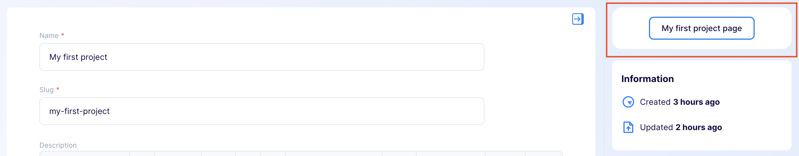
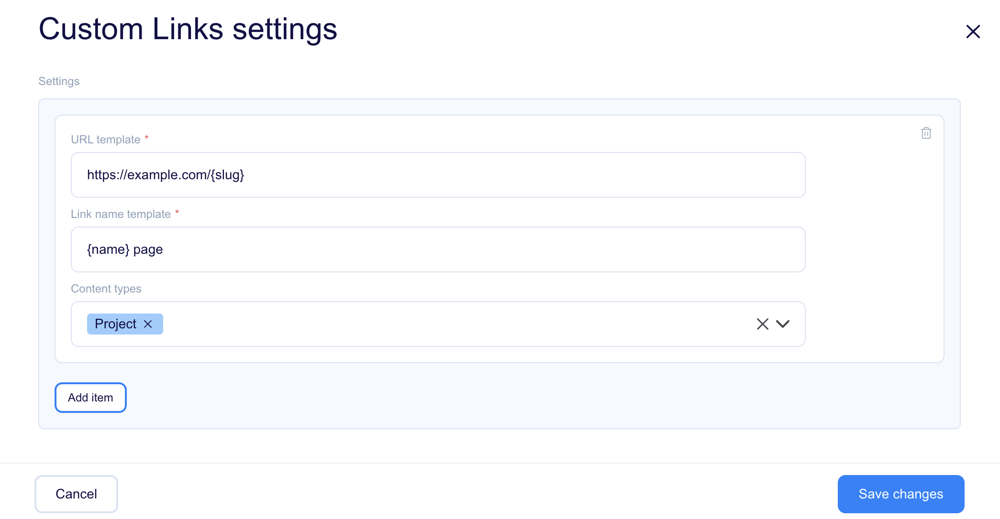

[[_TOC_]]

# About plugin

This plugin will display a button with a link in the content edit object. The link will be supplemented with data from the currently edited object. Thanks to this link, you will be able to easily access the preview of where the content will be used.

## Plugin outcome

In the sidebar of the Content Object form, you will see a panel with the configured link button. The button will not be visible when adding a new object.



## Configuring plugin

To manage a plugin, you must first add it to your plugins. Click the "+" icon to add the plugin to your library and click the "Manage" button. It will open the plugin settings.



Field descriptions: 

* `URL Template` - It's a place to enter the link template, e.g. https://my-blog/post/{slug}, where `slug` is the name of the content field of the type selected below. Instead of `{slug}`, you can use any field of a given content type, it is also possible to use nesting, e.g. `{internal.createdAt}`. You can also use list fields: `{addresses[0].city}`.
* `Displayed Name Template` - Any name that will be displayed on the link button.
* `Content Type Definition` - Select the content type to display the button only for the specified content type. If the content type is not selected, the button will be shown when editing each content object.

# Development

## Quick start

1. `yarn` - to install dependencies
2. `yarn start` - to start development mode - rebuild on file modifications
3. update your `plugin-manifest.json` file to contain the production URL and other plugin information
4. `yarn build` - to build plugins

## Dev environment

Dev environment is configured to use:

* `prettier` - best used with automatic format on save in IDE
* `eslint` - it is built into both `start` and `build` commands

## Output

The plugins are built into a single `dist/index.js` file. The manifest is copied to `dist/plugin-manifest.json` file.

## Deployment

<!-- TO DO -->

## Loading the plugin

**Warning:** While developing, you can use  `https://localhost:3053/plugin-manifest.json` address to load the plugin manifest. Make sure your browser trusts the local certificate on the latter, to be able to use it e.g. with `https://editor.flotiq.com`

### URL

**Hint**: You can use localhost url from development mode `https://localhost:3053/index.js`

1. Open Flotiq editor
2. Open Chrome Dev console
3. Execute the following script
   ```javascript
   FlotiqPlugins.loadPlugin('plugin-id', '<URL TO COMPILED JS>')
   ```
4. Navigate to the view that is modified by the plugin

### Directly

1. Open Flotiq editor
2. Open Chrome Dev console
3. Paste the content of `dist/index.js` 
4. Navigate to the view that is modified by the plugin

### Deployment

**Hint**: You can use localhost url from development mode `https://localhost:3053/plugin-manifest.json`

1. Open Flotiq editor
2. Add a new plugin and paste the URL to the hosted `plugin-manifest.json` file
3. Navigate to the view that is modified by the plugin